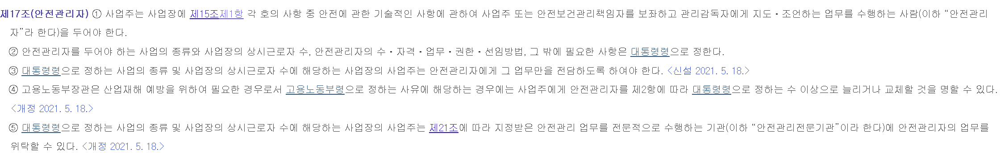
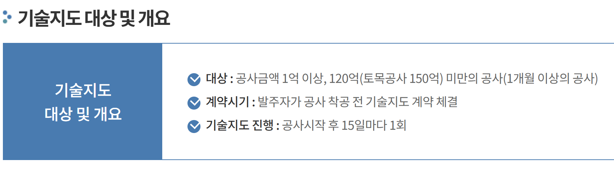
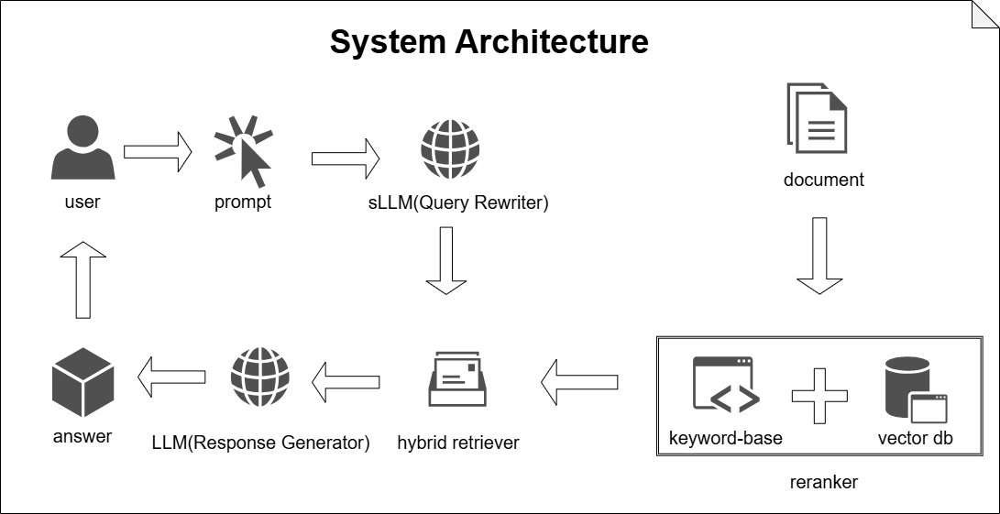
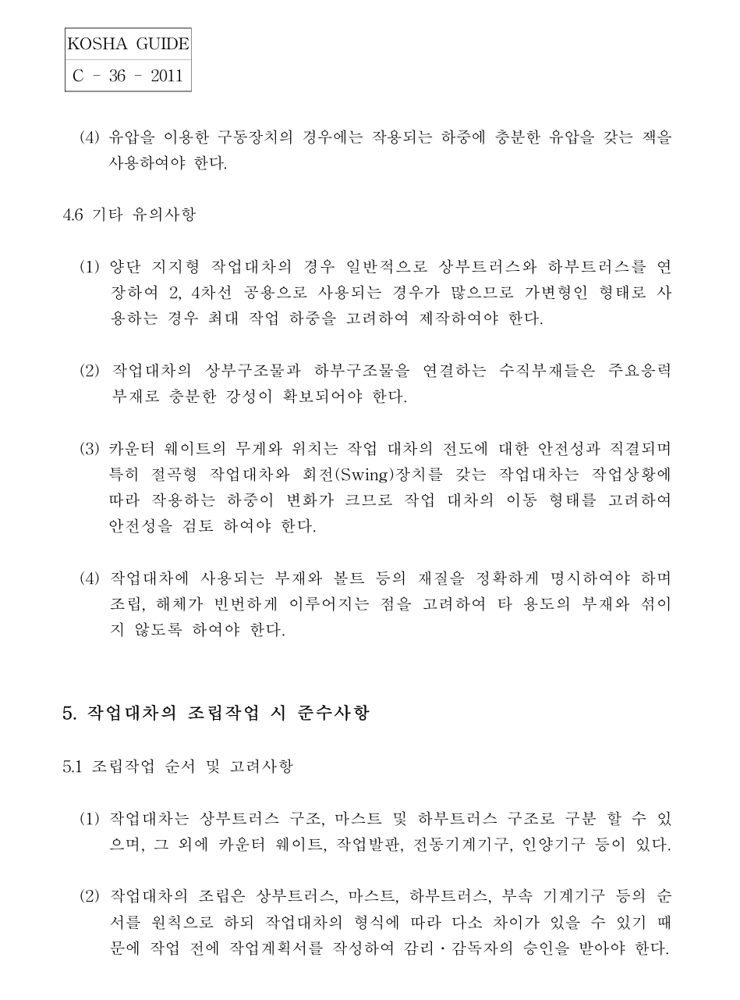
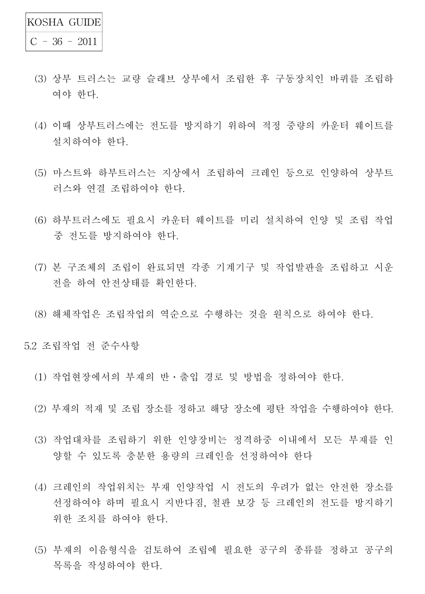
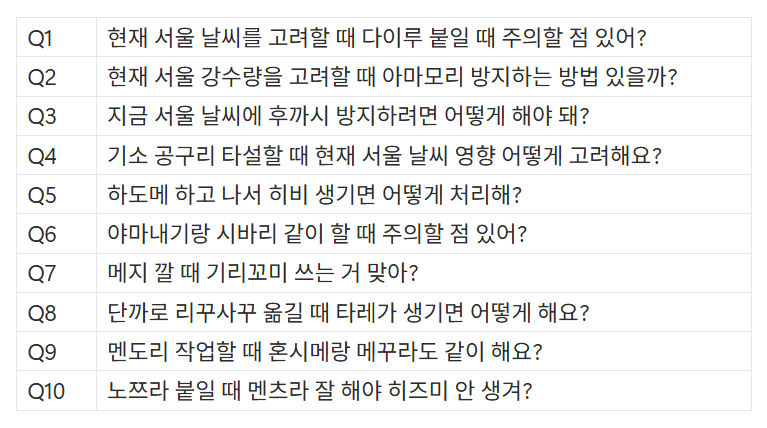
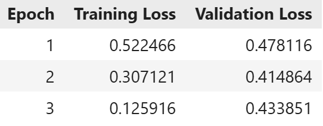
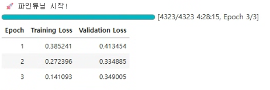
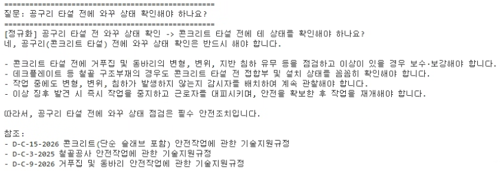

# 👷‍♂️ 건설 현장 안전 가이드 질의응답 챗봇

# 1. 팀 소개

## 팀명 : 헬프멧 (Helpmet)

> Help (도움) + Helmet (안전모)
> 헬멧이 머리를 지키듯, 우리는 현장의 안전을 지킵니다.

## 팀원 소개
 
| 김규호 | 박수영 | 박세현 | 이동민 | 최하진 |
| :---: | :---: | :---: | :---: | :---: |
|  |  |  |  |  |
|  |  |  |  |  |
> AI로 생성된 이미지입니다.

**프로젝트 기간**: 2026.04.08 ~ 2024.04.09 (2일)

# 2. 프로젝트 개요

## 2-1 프로젝트 명
**건설 현장 안전 가이드 질의응답 챗봇**

## 2-2 프로젝트 소개
**한국산업안전공단**에서 제·개정한 기술지원규정을 바탕으로 건설 안전 분야에서 활용할 수 있는 안전 지침을 안내하는 챗봇입니다.  

## 2-3 프로젝트 필요성

### ( 1 ) 프로젝트 배경 - 중대재해처벌법 전면 확대

2024년 1월부터 **5인 이상 50인 미만**의 모든 사업장에 중대재해처벌법이 적용되면서, 소규모 건설공사 현장 역시 사고 발생 시 경영책임자가 구속되거나 막대한 벌금을 부과받는 등 경영권 상실의 위협에 직면해 있습니다. 

대한건설정책연구원(건정연)에 따르면 최근 판례를 분석한 결과 **중소 건설업계가 법 위반에 가장 취약**한 것으로 나타났습니다.

> **출처:** [연합뉴스] ["중대재해법 사건 유죄율 '중소기업 건설사' 가장 높아"](https://www.yna.co.kr/view/AKR20250606015200003)

---

### ( 2 ) 현장의 문제점 - 소규모 현장(50억 미만)의 구조적 안전 사각지대

  

현행법상 **공사금액 50억 원 미만 현장**은 전담 안전관리자 선임 의무가 면제됩니다. 이로 인해 비전문가인 현장소장이 대형 현장과 동일한 법적 책임을 홀로 짊어지는 **구조적 공백**이 발생하며, 이는 **전체 건설업 사망 사고의 64.6%**가 소규모 현장에 집중되는 결과로 이어집니다.

* **전문성 한계 (연간 16시간 교육):** 현장소장(관리감독자)의 법정 정기 교육은 연간 16시간에 불과합니다. 전문가 없이 소장이 고도의 위험성평가와 법령 이행을 완벽히 수행하기에는 지식적·시간적 한계가 명확합니다.
* **관리의 공백 (15일 1회 지도):** 외부 전문기관의 기술지도는 2주(15일)에 1회 방문에 그칩니다. 매일 공정과 위험 요소가 급변하는 건설 현장의 특성상, 이러한 간헐적 점검만으로는 실시간 사고 예방이 불가능합니다.

---

### ( 3 ) 페르소나 정의 - 서비스 타겟 및 기획 배경

  

앞선 통계와 제도의 한계뿐만 아니라, 실제 현장소장의 인터뷰 기사에서도 전담 인력 부재로 인한 '안전 사각지대'의 위험성이 현장의 생생한 목소리로 확인됩니다. 
이처럼 중대재해처벌법의 압박 속에서 현장 안전 책임을 홀로 떠맡은 채, 방대한 법령 앞에서 막막함을 느끼는 실무자의 현실적인 고충을 바탕으로 타겟을 구체화했습니다.

> **출처:** [헤럴드경제] ["배치 의무가 없어서 안전 사각지대가 발생하기 쉬워.."](https://biz.heraldcorp.com/article/10677704)
---

#### 📋 법적 근거 및 실무적 한계 증빙

<table align="center">
  <tr>
    <td align="center">
      
       
      <em>[증빙 1] 산업안전보건법 제17조 (안전관리자 선임 기준)</em>
    </td>
    <td align="center">
      
       
      <em>[증빙 2] 시행규칙 제26조 (관리감독자 교육 시간)</em>
    </td>
  </tr>
</table>

  
   
  <em>[증빙 3] 건설재해예방기술지도 (15일 1회 방문 주기)</em>

> **출처:** > [매일경제] [사망사고 60%는 공사비 50억 미만 영세 공사현장](https://www.mk.co.kr/news/realestate/11439173)
> * [대한산업안전협회] [건설재해예방기술지도 안내](https://www.safety.or.kr/safety/main/contents.do?menuNo=200023)
> * 산업안전보건법 시행규칙 [별표 4] (안전보건교육 시간)

## 2-4 프로젝트 목표

* **기술 지침 접근성 확보:** KOSHA Guide는 2,000여 종에 달하며, 전체 분량은 약 6만 페이지를 넘습니다. 전담 인력이 없는 소규모 현장에서는 숙지와 적용이 사실상 어려운 현실입니다. 이에 건설 현장 안전 관련 핵심 규정 77건(약 1,800페이지)을 선별하여 챗봇으로 제공함으로써 접근성을 확보하고 실효성을 높이고자 합니다.
* **건설 현장 안전 제고:** 최근 특별 감독 결과에 따르면, 온습도계 비치 및 기록 관리와 같은 기초 수칙에서만 600건 이상의 위반이 적발되었습니다. 또한 사망 사고 60%는 50억 미만에서 일어나는 만큼 건설 현장 안전을 제고하는 데에 기여하고자 합니다.

---

# 3. 기술 스택 & 사용 모델 (Tech Stack & Models)

<table>
  <thead>
    <tr>
      <th style="text-align:center;">분류</th>
      <th style="text-align:center;">기술</th>
    </tr>
  </thead>
  <tbody>
    <tr>
      <td align="center">협업 및 형상 관리</td>
      <td>
        
        
      </td>
    </tr>
    <tr>
      <td align="center">개발 환경 & 언어</td>
      <td>
        
        
      </td>
    </tr>
    <tr>
      <td align="center">LLM</td>
      <td>
        
        
      </td>
    </tr>
    <tr>
      <td align="center">임베딩 & 검색</td>
      <td>
        
        
        
      </td>
    </tr>
    <tr>
      <td align="center">VectorDB</td>
      <td>
        
      </td>
    </tr>
    <tr>
      <td align="center">프레임워크</td>
      <td>
        
        
      </td>
    </tr>
    <tr>
      <td align="center">외부 API</td>
      <td>
        
      </td>
    </tr>
  </tbody>
</table>

## 3-1 RAG 파이프라인 구성 요소
- `ChromaDB` : 문서 청크 임베딩을 저장하고 질의와 유사한 문서를 검색하기 위한 VectorDB로 활용
- `ko-sroberta-multitask`, `BM25`, `Cohere-Rerank` : 임베딩 검색을 중심으로 키워드 검색과 재정렬 기법을 결합하여 검색 정확도와 상위 문서 정렬 성능을 개선
- `GPT-4.1-mini` : 검색된 문서를 바탕으로 사용자에게 답변을 생성하는 데 사용
- `LangChain`, `LangGraph` : 검색-재정렬-응답 생성 흐름을 구성하고 연결하는 데 활용

---

# 4. 시스템 아키텍쳐 (System Architecture)

 

---

# 5. WBS

----

# 6. 요구사항 명세서

| 분류 | 요구사항명 | 내용 | 상태 |
| --- | --- | --- | --- |
| 기능 | 데이터 전처리 | KOSHA PDF를 구조화된 JSON 데이터로 파싱 및 저장 | 완료 |
| 기능 | 도메인 특화 용어 해석 | 현장 은어가 포함된 질문을 해석할 수 있도록 파인튜닝 모델 적용 | 완료 |
| 기능 | 하이브리드 검색 | 사용자 질문에 대해 Dense Retrieval과 BM25 기반 검색을 병행하여 관련 KOSHA 규정을 검색 | 완료 |
| 기능 | ReRank 적용 | 검색 결과를 ReRank하여 질문과 관련도 높은 문서를 우선 반영 | 완료 |
| 기능 | RAG 기반 답변 생성 | 검색된 지침을 바탕으로 근거 기반 답변 생성 | 완료 |
| 기능 | 출처 제공 | 답변에 KOSHA 가이드라인명 및 문서 식별자 포함 | 완료 |
| 기능 | 대화 이력 관리 | 이전 질문 맥락을 유지해 후속 질문 처리 | 완료 |
| 비기능 | 응답 속도 | 답변 생성까지 10초 이내로 응답 | 완료 |
| 비기능 | 용어 적합성 | 현장 관리자가 이해하기 쉬운 표현 사용 | 완료 |
| 비기능 | 인터페이스 | 웹 환경의 직관적인 채팅형 UI 제공 | 완료 |

---

# 7. 수집한 데이터 및 전처리 요약

## 7-1 RAG용 문서 데이터 수집

<table align="center">
  <tr>
    <td align="center">
        
       
      <em>원본 pdf 예시 1</em>
    </td>
    <td align="center">
      
       
      <em>원본 pdf 예시 2</em>
    </td>
  </tr>
</table>

#### KOSHA 안전규정집

- 건설·산업안전 분야 질의응답의 신뢰성을 높이기 위해 **KOSHA 안전규정집**을 RAG의 기반 문서로 활용하였습니다.  

- KOSHA 문서는 작업 공정별 안전기준과 예방수칙을 포함하고 있어, 현장 질의를 공식 기준과 연결하는 데 적합합니다. 또한 답변 생성 시 근거 문서를 함께 제시할 수 있어, 일반 생성형 응답보다 **설명 가능성**과 **신뢰성**을 높일 수 있다고 판단하였습니다.

> **출처 링크:**  
> [KOSHA 안전규정집](https://portal.kosha.or.kr/archive/resources/tech-support/search/const?page=1&rowsPerPage=10)

---
## 7-2 전처리 과정 요약
- `pdfplumber`를 사용하여 KOSHA GUIDE PDF의 텍스트와 표를 추출
- 헤더, 문서 번호, 페이지 번호, 목차, 개정이력, 부록 등 검색에 불필요한 노이즈 제거
- 숫자 기반 헤딩 구조를 인식하여 문서의 계층 정보 유지
- Parent-Child 구조의 청크 생성
- Task/Space는 키워드 규칙 기반으로 분류하고, Category/Keyword는 API를 활용해 태깅
- 청크 ID, 계층 정보, parent_id, 문서명 등을 포함한 JSON 데이터셋 구축
  
## 7-3 전처리 결과
- 전처리 후 데이터는 Parent-Child 구조의 JSON 형태로 저장
- Parent Chunk는 상위 문맥을 유지한 답변 생성용 데이터로 활용
- Child Chunk는 세부 검색용 데이터로 활용

- [전처리 상세 보고서 보기](./docs/preprocessing_report.md)
  
---

# 8. DB 연동 구현 코드 (링크만)

- [DB 연동 구현 코드](./src/build_vectordb.py)

---

# 9. 테스트 계획 및 결과 보고서

### 테스트 문항
 

### 테스트 항목

- 출처 정확도: 모델이 답변한 내용이 실제 KOSHA 가이드 근거와 일치하는지 검증.
- 은어 해석: 건설 현장 특유의 일본어식 외래어 및 은어를 표준어로 변환하여 정확한 안전 규정을 찾아내는지 검증.
- 응답 시간: 질문 입력 시점부터 최종 답변 완료 시점까지 사용자에게 실시간 서비스를 제공하기에 적절한 속도인지 검증. (10초)
- 문맥 유지 여부: 대화 흐름을 기억하여 지시 대명사(그거, 저번에 말한 것 등)를 이해하는지 검증.
- 날씨 연동: 날씨 정보가 필요한 경우 실시간 날씨 정보를 안전 규정과 결합하여 현장 맞춤형 조언을 제공하는지 검증.

### 테스트 결과

| 테스트 문항 | 출처 정확도 | 은어 해석 | 응답 시간 | 문맥 유지 여부 | 날씨 연동 |
| --- | --- | --- | --- | --- | --- |
| Q1 | O | O | O | O | O |
| Q2 | O | O | X | O | O |
| Q3 | O | O | X | O | O |
| Q4 | O | O | O | O | O |
| Q5 | O | O | O | O | - |
| Q6 | O | O | O | O | - |
| Q7 | O | X | O | O | - |
| Q8 | X | X | O | O | - |
| Q9 | O | O | O | O | - |
| Q10 | O | O | O | O | - |

### 테스트 시연 결과

# 10. 진행 과정 중 프로그램 개선 노력 (Program Optimization)

본 프로젝트에서는 전문적인 건설 안전 기술 지침(KOSHA Guide) 데이터를 정확히 검색하기 위해, 다양한 검색 방식을 활용하여 성능을 평가하였습니다.

## 10.1 RAG 검색 성능 최적화

#### 1) 성능 평가를 위한 데이터셋 생성
실제 건설 현장에서 발생할 수 있는 구체적인 상황을 가정하여 PDF 기반으로 10가지의 <b>테스트 질문 세트(Test Queries)</b>를 직접 생성하였습니다.

  
   

#### 2) Dense Retrieval 성능 향상을 위한 임베딩 모델 비교
데이터셋 질의를 다시 입력하여 Dense Retrieval 단계에서의 검색 유사도 점수를 비교하였습니다. 비교 대상 모델은 `ko-sroberta-multitask(이하 ko-sroberta)`, `nlpai-lab/KURE-v1`, `dragonkue/BGE-m3-ko`, `BAAI/bge-m3` 총 4종이며, 대표 질의 5건에 대한 결과를 정리하였습니다.

**[표 1] 데이터셋 대표 질의 5건에 대한 임베딩 모델별 유사도 점수 비교**
| 질문 요약 | ko-sroberta | KURE-v1 | BGE-m3-ko | BAAI/bge-m3 | 최고 모델 |
|---|---:|---:|---:|---:|---|
| 철골 기둥 작업 중단 풍속 기준 | **0.777** | 0.629 | 0.652 | 0.711 | ko-sroberta |
| 슬래브 처짐 실측 항목 | **0.757** | 0.562 | 0.569 | 0.683 | ko-sroberta |
| PS 강선 인장잭 방호시설 | **0.796** | 0.581 | 0.638 | 0.728 | ko-sroberta |
| 데크플레이트 콘크리트 타설 순서 | **0.806** | 0.665 | 0.643 | 0.670 | ko-sroberta |
| 데크플레이트 끝단 고정 방법 | **0.857** | 0.629 | 0.757 | 0.791 | ko-sroberta |

대표 질의 비교 결과, `ko-sroberta-multitask`가 모든 항목에서 가장 높은 유사도 점수를 기록하였으며, 특히 데크플레이트 관련 질의와 같이 작업 절차 및 시공 맥락이 포함된 질문에서도 안정적인 검색 성능을 보여, 한국어 건설 안전 문서 검색에 가장 적합한 임베딩 모델로 판단하였습니다.

**[표 2] 임베딩 모델별 평균 유사도 점수 비교**
| 모델 | 평균 유사도 | 요약 |
|---|---:|---|
| ko-sroberta | **0.786** | 가장 안정적 |
| BAAI/bge-m3 | 0.698 | 중간 수준 |
| BGE-m3-ko | 0.632 | 낮은 편 |
| KURE-v1 | 0.613 | 개선 필요 |

평균 유사도 기준으로도 `ko-sroberta-multitask`가 **0.786**으로 가장 높은 값을 기록하였으며, `BAAI/bge-m3`는 중간 수준, `BGE-m3-ko`와 `KURE-v1`는 상대적으로 낮은 성능을 보였습니다. 이를 통해 Dense Retrieval의 기본 임베딩 모델은 `ko-sroberta-multitask`로 선정하였습니다.

#### 3) 검색 방식별 성능 비교 및 ReRank 모델 선정
생성된 데이터셋을 활용하여 네 가지 주요 검색 방식의 성능 지표(유사도, 점수 등)를 측정했습니다.

* **Dense Retrieval:** 벡터 유사도 기반 검색
* **BM25:** 키워드 기반 전통적 검색
* **RRF (Reciprocal Rank Fusion):** Dense와 BM25의 순위를 혼합하는 방식
* **ReRank:** 검색된 결과의 순위를 LLM을 통해 다시 매기는 방식

  
   
<em>[이미지 2] 각 질문별 검색 방식의 초기 성능 지표(Baseline) 분석</em>

> **초기 분석 결과:** 지표를 분석한 결과, 단일 모델(Dense/BM25) 대비 혼합 검색(RRF) 및 ReRank 적용 시 검색 품질이 향상됨을 확인했습니다. 특히 ReRank 점수가 평균 0.9 이상으로 높게 나타나, 건설 전문 용어가 포함된 복잡한 질의에 대해 ReRanker를 도입하고자 하였습니다.

단순 유사도 검색의 한계를 극복하고, 실제 현장 지침으로서의 신뢰도를 확보하기 위해 4가지 검색 방식의 성능을 정량적으로 비교 분석했습니다.

  
   
<em>[이미지 3] 검색 방식별 주요성능 지표(P@5, R@5, MRR, MAP) 비교</em>

실험 결과, **ReRank 방식**이 높은 성능 향상을 보여주었습니다. 특히 정답 문서가 상위에 위치하는지를 평가하는 **MRR(Mean Reciprocal Rank)**과 순위 정확도를 나타내는 **MAP(Mean Average Precision)** 지표에서 눈에 띄는 결과를 기록했습니다.

**ReRank 모델 최종 선정 사유**
* **최상단 응답 정확도 혁신 (MRR 45% 향상)**
    * Baseline(Dense, 0.51) 대비 **MRR 0.7449**를 기록하여 최상위 결과의 정확도를 대폭 개선했습니다.
* **전문 도메인 맥락 파악**
    * 1차 검색(BM25/Dense)이 확보한 후보군을 재정렬하여, 건설 현장의 복잡한 **전문 용어와 미세한 지침 차이를 정밀하게 구분**해냈습니다.
* **신뢰도 향상**
    * 질의별 최종 점수 분석 결과, **평균 0.95 이상의 높은 신뢰도**를 확보했습니다.

#### 4) 검색 파라미터 최적화 실험 및 모델 비교
검색 범위(K)와 혼합 비중(`RRF Top N`)에 변화를 주며, `v3.0` 시리즈의 두 모델(PRO vs Multilingual)을 대상으로 성능을 극대화할 수 있는 임계점을 도출했습니다.

#### [실험 A] rerank-v4.0-pro 성능 지표

빠른 처리 속도와 안정적인 점수대를 보였습니다.

| 조합 | BM25 (K) | Dense (K) | RRF Top N | 평균 Top1 Score | 소요 시간 (초) |
| :--- | :---: | :---: | :---: | :---: | :---: |
| 1 | 20 | 20 | 10 | 0.9644 | 26.9 |
| 2 | 30 | 30 | 15 | 0.9645 | 21.2 |
| 3 | 30 | 30 | 20 | 0.9644 | 21.8 |
| 4 | 40 | 40 | 20 | 0.9643 | 22.9 |
| 5 | 40 | 40 | 30 | 0.9663 | 22.8 |
| 6 | 50 | 50 | 30 | 0.9654 | 21.7 |
| **7** | **50** | **50** | **40** | **0.9663** | **23.2** |

#### [실험 B] rerank-multilingual-v3.0 성능 지표

마찬가지로 높은 성능을 보이고 처리속도도 빠름

| 조합 | BM25 (K) | Dense (K) | RRF Top N | 평균 Top1 Score | 소요 시간 (초) |
| :--- | :---: | :---: | :---: | :---: | :---: |
| 1 | 20 | 20 | 10 | 0.9541 | 21.1 |
| 2 | 30 | 30 | 15 | 0.9541 | 21.0 |
| 3 | 30 | 30 | 20 | 0.9539 | 20.7 |
| 4 | 40 | 40 | 20 | 0.9539 | 21.0 |
| 5 | 40 | 40 | 30 | 0.9540 | 20.7 |
| 6 | 50 | 50 | 30 | 0.9540 | 20.8 |
| **7 (최적)** | **50** | **50** | **40** | **0.9691** | **20.8** |

---

**실험 결과 분석 및 모델 선정**
1. **정확도(Accuracy):** `Multilingual` 모델이 조합 7에서 **0.9691**을 기록하며, `PRO` 모델(0.9663)보다 기술 지침 검색에 더 적합함을 입증했습니다.
2. **효율성(Efficiency):** `Multilingual` 모델은 파라미터가 증가해도 소요 시간이 약 20.8초로 일정하게 유지되어, `PRO` 모델 대비 시간 효율성 면에서도 우위를 점했습니다.
3. **최종 결정:** 높은 성능과 안정적인 처리속도를 모두 확보한 **`rerank-multilingual-v3.0`의 조합 7** 설정을 프로젝트의 최종 검색 엔진으로 채택하였습니다.

---

### 10.2 현장 용어 이해를 위한 파인튜닝 (LLM Fine-tuning)

건설 현장에서는 '단도리', '시마이' 등 특유의 은어와 현장 용어가 빈번하게 사용됩니다. 현장 작업자의 실제 질의를 챗봇이 정확히 이해하고 관련 안전 지침을 검색할 수 있도록, 오픈소스 한국어 LLM을 대상으로 파인튜닝을 진행하고 최적의 베이스 모델을 선정했습니다.

#### 1) 베이스 모델 비교 및 정량적 평가 (Loss 지표)
동일한 건설 현장 은어-표준어 데이터셋을 활용하여 3가지 주요 한국어 Llama-3 파생 모델의 학습을 진행하고, Training/Validation Loss 추이를 비교 분석했습니다.

<table align="center">
  <tr>
    <td align="center">
      
       
      <em>[이미지 4] beomi/Llama-3-Open-Ko-8B 모델</em>
    </td>
    <td align="center">
      
       
      <em>[이미지 5] saltlux/Ko-Llama3-Luxia-8B 모델 결과</em>
    </td>
  </tr>
</table>

  
   
<em>[이미지 6] EEVE-Korean-Instruct-10.8B 모델 결과</em>

<table align="center">
  <thead>
    <tr>
      <th align="left">베이스 모델명</th>
      <th align="center">최저 Validation Loss</th>
      <th align="left">평가 요약</th>
    </tr>
  </thead>
  <tbody>
    <tr>
      <td align="left"><b>beomi/Llama-3-Open-Ko-8B</b></td>
      <td align="center">0.9442 (Step 2250)</td>
      <td align="left">학습이 진행되며 수렴하나, 비교군 중 가장 높은 Loss 기록</td>
    </tr>
    <tr>
      <td align="left"><b>saltlux/Ko-Llama3-Luxia-8B</b></td>
      <td align="center">0.8650 (Epoch 2)</td>
      <td align="left">준수한 성능을 보이나 0.8대 이하로 최적화되지 못함</td>
    </tr>
    <tr>
      <td align="left"><b>EEVE-Korean-Instruct-10.8B</b></td>
      <td align="center"><b>0.4148 (Epoch 2)</b></td>
      <td align="left"><b>가장 빠르고 안정적인 수렴, 압도적으로 낮은 Loss 달성</b></td>
    </tr>
  </tbody>
</table>

#### 2) EEVE 모델 최종 선정 근거 및 파인튜닝 결과
**① Val Loss 지표의 우위:**
`EEVE-Korean-Instruct-10.8B-v1.0` 모델은 단 2 Epoch 만에 **Validation Loss 0.4148**을 기록하며 타 모델 대비 절반 수준의 낮은 손실률을 보여주었습니다. 

**② 은어 문장 표준화 테스트 성공:**
학습된 EEVE 모델을 대상으로 실제 현장 은어 번역 테스트를 수행한 결과, 은어를 치환하여 표준어 문장을 구사하는 테스트를 성공적으로 수행하였습니다. 

**[추론 테스트 결과 요약]**

  
   
 <em>EEVE-Korean-Instruct-10.8B 모델 추론 결과</em>

  

**결론:** 일부 과적합 양상을 보이지만, 문장 변환 테스트를 성공적으로 수행한 **EEVE-Korean-Instruct-10.8B 모델을 본 프로젝트의 최종 파인튜닝 베이스 모델로 채택**하여, 현장 작업자가 은어를 사용하여 질문하여도 정확한 답변을 낼 수 있도록 구현하였습니다.

---

## 한 줄 회고

| 이름 | 한 줄 회고 |
| :--- | :--- |
| **김규호** |  |
| **박수영** |  |
| **박세현** |  |
| **이동민** | |
| **최하진** |  |
