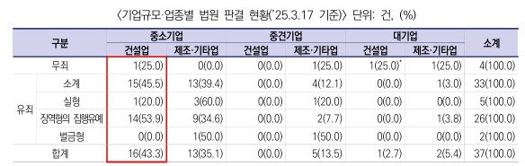
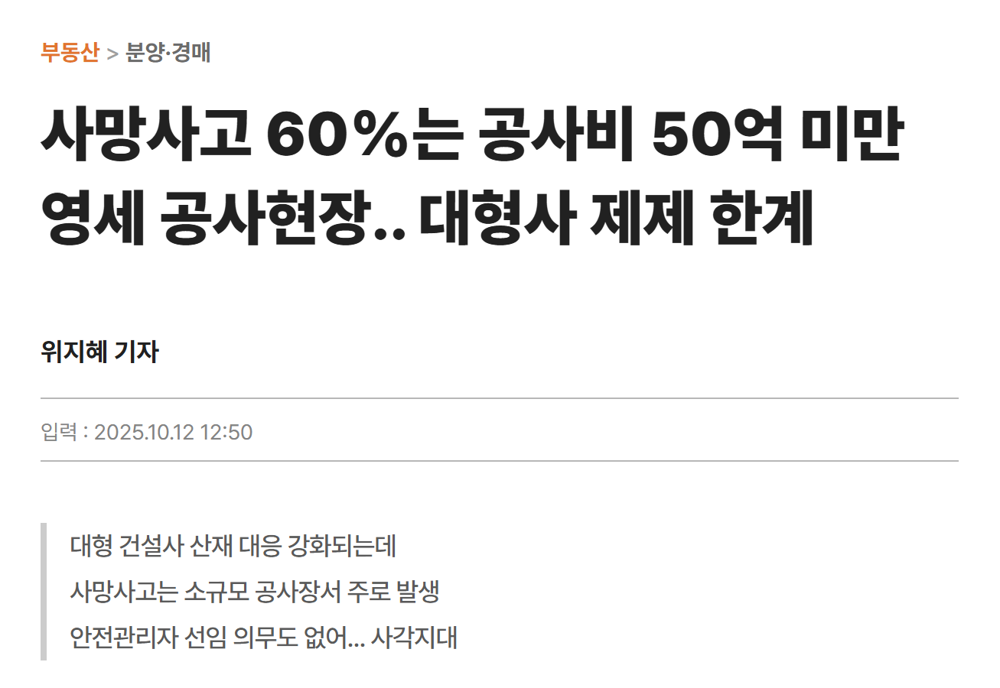
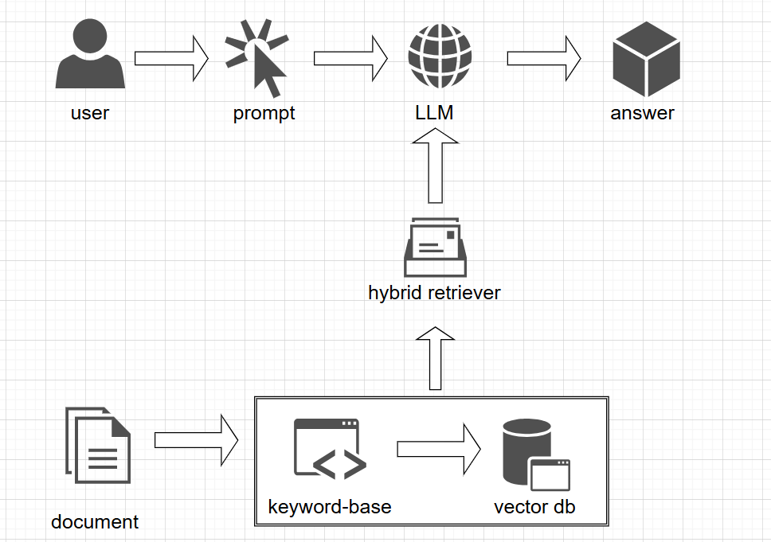
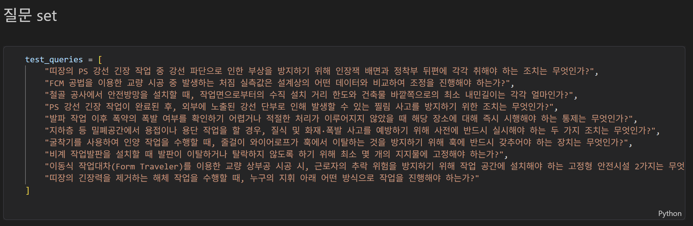
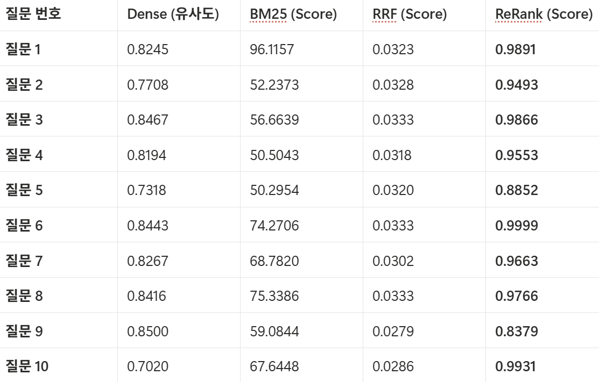
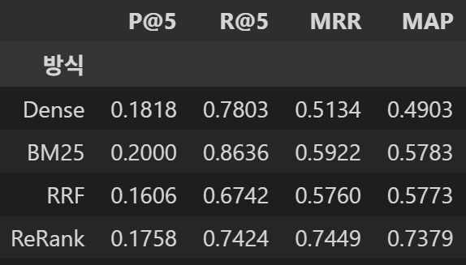
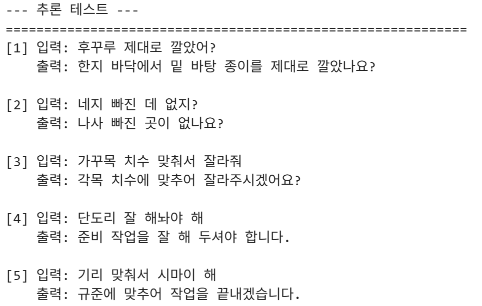

# 👷‍♂️ 건설 현장 안전 가이드 질의응답 챗봇

# 1. 팀 소개

* **팀명: 헬프멧 (Helpmet)**

> 헬멧이 머리를 지키듯, 우리는 현장의 안전을 지킵니다.

* **팀원 소개**
 
| 김규호 | 박수영 | 박세현 | 이동민 | 최하진 |
| :---: | :---: | :---: | :---: | :---: |
|  |  |  |  |  |
| [](https://github.com/kyu5KIm) | [](https://github.com/suyoung6279) | [](https://github.com/parksay) | [](https://github.com/LeeDongMin0115) | [](https://github.com/hun6684) |

**프로젝트 기간**: 2026.04.08 ~ 2024.04.09 (2일)

</div>


## 2. 프로젝트 개요

### 2-1 프로젝트 명
**건설 현장 안전 가이드 질의응답 챗봇**

### 2-2 프로젝트 소개
**한국산업안전공단**에서 제·개정한 기술지원규정을 바탕으로 건설 안전 분야에서 활용할 수 있는 안전 지침을 안내하는 챗봇입니다.  

### 2-3 프로젝트 필요성(배경)

#### 🔴 중대재해처벌법 적용의 전면 확대
<p align="center">
  
</p>

2024년 1월부터 **5인 이상 50인 미만**의 모든 사업장에 중대재해처벌법이 적용되면서, 소규모 건설공사 현장 역시 사고 발생 시 경영책임자가 구속되거나 막대한 벌금을 부과받는 등 경영권 상실의 위협에 직면해 있습니다. 

대한건설정책연구원(건정연)에 따르면 최근 판례를 분석한 결과 **중소 건설업계가 법 위반에 가장 취약**한 것으로 나타났습니다. 이는 인력·예산 부족과 함께 안전·보건관리체계 구축과 이행이 본질적으로 어려운 건설업 특성 때문입니다.

> **출처:** [연합뉴스] ["중대재해법 사건 유죄율 '중소기업 건설사' 가장 높아"](https://www.yna.co.kr/view/AKR20250606015200003)

---

#### ⚠️ 안전관리 선임 예외의 역설
<p align="center">
  
</p>

현행법상 **50억 미만 건설현장**은 전담 안전관리자 선임 의무가 면제됩니다. 이로 인해 법적 책임은 대형 현장과 동일하게 지면서도, 정작 현장에서 법령을 해석하고 이행을 지원할 전문 인력이 배치되지 않는 **구조적 사각지대**가 발생하고 있습니다.

* **사망 사고의 64.6%(212명):** 공사비 50억 원 미만의 소규모 현장에서 발생
* **산업재해 건수 절반 이상(53%):** 소규모 현장이 차지하는 심각한 불균형

일각에서는 소규모 현장에 대한 안전 지원 확대와 감독 인프라 보강이 함께 이뤄져야 한다는 지적이 나옵니다.

> **출처:** [매일경제] [사망사고 60%는 공사비 50억 미만 영세 공사현장.. 대형사 제제 한계](https://www.mk.co.kr/news/realestate/11439173)

### 2-4 프로젝트 목표

* **기술 지침 접근성 확보:** KOSHA Guide는 2,000여 종에 달하며, 전체 분량은 약 6만 페이지를 넘습니다. 전담 인력이 없는 소규모 현장에서는 숙지와 적용이 사실상 어려운 현실입니다. 이에 건설 현장 안전 관련 핵심 규정 77건(약 1,800페이지)을 선별하여 챗봇으로 제공함으로써 접근성을 확보하고 실효성을 높이고자 합니다.
* **건설 현장 안전 제고:** 최근 특별 감독 결과에 따르면, 온습도계 비치 및 기록 관리와 같은 기초 수칙에서만 600건 이상의 위반이 적발되었습니다. 또한 사망 사고 60%는 50억 미만에서 일어나는 만큼 건설 현장 안전을 제고하는 데에 기여하고자 합니다.

---

## 3. 기술 스택 & 사용 모델 (Tech Stack & Models)

<table>
  <thead>
    <tr>
      <th style="text-align:center;">분류</th>
      <th style="text-align:center;">기술</th>
    </tr>
  </thead>
  <tbody>
    <tr>
      <td align="center">협업 및 형상 관리</td>
      <td>
        
        
      </td>
    </tr>
    <tr>
      <td align="center">개발 환경 & 언어</td>
      <td>
        
        
      </td>
    </tr>
    <tr>
      <td align="center">LLM</td>
      <td>
        
      </td>
    </tr>
    <tr>
      <td align="center">임베딩 & 검색</td>
      <td>
        
        
        
      </td>
    </tr>
    <tr>
      <td align="center">VectorDB</td>
      <td>
        
      </td>
    </tr>
    <tr>
      <td align="center">프레임워크</td>
      <td>
        
        
      </td>
    </tr>
    <tr>
      <td align="center">외부 API</td>
      <td>
        
      </td>
    </tr>
  </tbody>
</table>

- `ChromaDB`는 문서 청크 임베딩을 저장하고 질의와 유사한 문서를 검색하기 위한 VectorDB로 활용
- 임베딩 검색은 `ko-sroberta-multitask`를 중심으로 구성, `BM25`와 `Cohere-Rerank`를 함께 적용하여 검색 정확도와 상위 문서 정렬 성능을 개선
- `GPT-4.1-mini`는 검색된 문서를 바탕으로 사용자에게 이해하기 쉬운 형태의 답변을 생성하는 데 사용
- `LangChain`, `LangGraph`는 검색-재정렬-응답 생성 흐름을 구성하고 연결하는 데 활용

---

## 4. 시스템 아키텍쳐 (System Architecture)

<p align="center">
  
</p>

---

## 5. WBS


----

## 6. 요구사항 명세서

| 분류 | 요구사항명 | 내용 | 상태 |
| --- | --- | --- | --- |
| 기능 | 데이터 전처리 | KOSHA PDF를 구조화된 JSON 데이터로 파싱 및 저장 | 완료 |
| 기능 | 지침 검색 | 사용자 질문에 맞는 KOSHA 규정을 검색하여 제시 | 완료 |
| 기능 | ReRank 모델 선정 | 검색 알고리즘별 성능을 비교하고 ReRank 모델을 선정하여 검색 정확도를 향상 | 완료 |
| 기능 | RAG 기반 답변 생성 | 검색된 지침을 바탕으로 근거 기반 답변 생성 | 완료 |
| 기능 | 도메인 특화 용어 해석 | 현장 은어가 포함된 질문을 해석할 수 있도록 파인튜닝 모델 적용 | 완료 |
| 기능 | 출처 제공 | 답변에 KOSHA 가이드라인명 및 문서 식별자 포함 | 완료 |
| 기능 | 대화 이력 관리 | 이전 질문 맥락을 유지해 후속 질문 처리 | 완료 |
| 비기능 | 응답 속도 | 답변 생성까지 10초 이내로 응답 | 확인 중 |
| 비기능 | 용어 적합성 | 현장 관리자가 이해하기 쉬운 표현 사용 | 완료 |
| 비기능 | 인터페이스 | 웹 환경의 직관적인 채팅형 UI 제공 | 완료 |

---

## 7. 수집한 데이터 및 전처리 요약

### 7-1 RAG용 문서 데이터 수집

#### KOSHA 안전규정집

- 건설·산업안전 분야 질의응답의 신뢰성을 높이기 위해 **KOSHA 안전규정집**을 RAG의 기반 문서로 활용하였습니다.  

- KOSHA 문서는 작업 공정별 안전기준과 예방수칙을 포함하고 있어, 현장 질의를 공식 기준과 연결하는 데 적합합니다. 또한 답변 생성 시 근거 문서를 함께 제시할 수 있어, 일반 생성형 응답보다 **설명 가능성**과 **신뢰성**을 높일 수 있다고 판단하였습니다.

> **출처 링크:**  
> [KOSHA 안전규정집](https://portal.kosha.or.kr/archive/resources/tech-support/search/const?page=1&rowsPerPage=10)

---

### 7-2 전처리 과정

`pdfplumber`를 사용하여 KOSHA GUIDE PDF의 텍스트와 표를 추출
  
### 불필요한 노이즈 제거 
  검색에 불필요한 요소를 제거하고 문서 구조를 최대한 유지하기 위해 줄 단위 및 페이지 단위 노이즈 제거
- **줄 단위 제거 대상**
  - `KOSHA GUIDE` : 문서 상단 헤더
  - `D-C-7-2026` : 문서 번호
  - `- 1 -` : 페이지 번호
  - `<그림 1>`, `그림 1.` : 그림 캡션
  - `목 차` : 목차 제목
  - 개정이력, 부록 관련 텍스트

- **페이지 전체 스킵 대상**
  - 부록 페이지
  - 개정이력 페이지
  - 제안개요 페이지
  - 심의개요 페이지

- `is_noise()` : 각 줄이 제거 대상 노이즈인지 판별
- `should_skip_page()` : 페이지 전체를 제외할지 판별
### 헤딩 인식 및 구조화
- 문서의 상위 문맥을 유지하기 위해 숫자로 시작하는 줄을 헤딩으로 인식

 - `heading_pattern` : 숫자로 시작하는 줄을 헤딩으로 판별하는 정규식
 - `parse_heading()` : 헤딩인 경우 `(depth, 번호, 제목)`을 반환하고, 일반 문장인 경우 `None`을 반환

 - **헤딩 depth는 번호의 점(`.`) 개수를 기준으로 결정**
   - `7` → depth 1
   - `7.1` → depth 2
   - `7.1.1` → depth 3
 
### 부모 청크 생성 
  숫자 기반 헤딩 구조(예: `7`, `7.1`, `7.1.1`)를 기준으로 문서의 상위 문맥을 유지하는 부모 청크 생성
  
### 자식 청크 생성
  부모 청크 내부에서 항목 표현(예: `(1)`, `(가)`, `①`)을 기준으로 내용을 세분화한 자식 청크 생성

### 청크 태깅 및 카테고리 분류
  - Task와 Space는 사전 정의한 키워드 규칙을 기반으로 자동 분류
  - Category와 Keyword는 API를 활용해 생성 및 태깅
  - 자식 청크에는 부모 청크의 태그를 복사하여 일관성을 유지
  
### JSON 데이터셋 구축
  청크 ID, 계층 정보(depth), parent_id, 문서명 등의 메타데이터를 포함한 JSON 데이터셋을 구축

---

### 7-3 전처리 결과

**부모 청크 샘플**
```json
{
  "chunk_id": "f504de12fe52",
  "chunk_type": "parent",
  "source": "C-06-2015 타일(Tile)공사 안전보건작업 지침.pdf",
  "title": "타일(Tile)공사 안전보건작업 지침",
  "year": 2015,
  "status": "Active",
  "depth_1": "3 용어의 정의",
  "depth_2": "",
  "depth_3": "",
  "category": "작업 절차",
  "task": "조적미장",
  "space": "내부",
  "keyword": [
    "타일공사",
    "타일",
    "타일 붙이기"
  ],
  "content": "(1) 이 지침에서 사용하는 용어의 정의는 다음과 같다.\n(가) “타일공사(Tiling, Tile works)”란 각종 타일붙이기에 관한 공사를 말한다.\n(나) “타일(Tile)”이란 점토나 암석의 분말(또는 도토, 자토)을 성형 소성하여 만든 얇은 판형의 것을 말하고, 보통 타일은 도자기 타일을 말한다.\n(다) “타일의 종류”란 아래와 같이 분류한다.\n① 원재료의 질(質)에 의한 분류\n㉮ 도기질\n㉯ 자기질\n㉰ 반자기질 등\n② 제(조)법에 의한 분류\n㉮ 습식타일\n㉯ 건식타일\n㉰ 반건식타일\n③ 용도상에 의한 분류\n㉮ 외부용(벽체 보호상 흡수율이 적은 것)\n㉯ 내부용(벽, 바닥, 천정용)\n(라) “타일나누기”란 도면 또는 관리감독자의 지시에 따라 수준기, 레벨 및 다림추 등을 사용하여 기준선을 정하고 될 수 있는 대로 온장을 사용할 수 있도록 사전에 타일 부착 면에 나누기를 하는 것을 말한다.\n(마) “타일 붙이기”란 현장 배합 모르타르, 기성 배합 모르타르 및 접착제 등 붙임 재료를 사용하여 바탕 면에 타일을 붙이는 것을 말한다.\n(바) “붙임시간(Open Time)”이란 접착 모르타르나 접착제를 바탕면 또는 타일면에 발라 타일붙이기 하기에 적당한 상태가 되기까지의 최대 한계시간을 말한다.\n(사) 그 밖의 이 지침에서 사용하는 용어의 정의는 특별한 경우를 제외하고는 산업안전보건법, 같은 법 시행령, 같은 법 시행규칙, 안전보건규칙 및 관련 고시에서 정하는 바에 따른다."
}
```
**자식 청크 샘플**
```json
{
  "chunk_id": "11cd3f586044",
  "chunk_type": "child",
  "parent_id": "f504de12fe52",
  "source": "C-06-2015 타일(Tile)공사 안전보건작업 지침.pdf",
  "title": "타일(Tile)공사 안전보건작업 지침",
  "year": 2015,
  "status": "Active",
  "depth_1": "3 용어의 정의",
  "depth_2": "",
  "depth_3": "",
  "category": "작업 절차",
  "task": "조적미장",
  "space": "내부",
  "keyword": ["타일공사", "타일", "타일 붙이기"],
  "content": "(마) “타일 붙이기”란 현장 배합 모르타르, 기성 배합 모르타르 및 접착제 등 붙임 재료를 사용하여 바탕 면에 타일을 붙이는 것을 말한다."
}
```
## 8. DB 연동 구현 코드 (링크만)

## 9. 테스트 계획 및 결과 보고서

## 10. 진행 과정 중 프로그램 개선 노력 (Program Optimization)

RAG 기반 챗봇의 답변 품질은 **'질문에 맞는 정확한 문서를 얼마나 잘 찾아오느냐(Retrieval Performance)'** 에 달려 있습니다. 본 프로젝트에서는 전문적인 건설 안전 기술 지침(KOSHA Guide) 데이터를 정확히 검색하기 위해, 다양한 검색 아키텍처를 시뮬레이션하고 정량적으로 비교·분석하며 프로그램을 개선했습니다.

### 10-1 성능 평가를 위한 골든 데이터셋(Golden Dataset) 구축

가장 먼저, 실제 건설 현장에서 발생할 수 있는 구체적인 상황을 가정하여 10가지의 **고품질 테스트 질문 세트(Test Queries)** 를 직접 구축했습니다. 이는 LLM이 임의로 생성한 질문이 아닌, 전문 지식이 필요한 질문들로 구성되어 검색 모델의 변별력을 높였습니다.

<p align="center">
  
  <br>
  <em>[이미지 1] 성능 평가에 사용된 골든 데이터셋(Golden Dataset) 예시</em>
</p>

### 10-2. Dense Retrieval 성능 향상을 위한 임베딩 모델 비교

골든 데이터셋 질의를 다시 입력하여 Dense Retrieval 단계에서의 검색 유사도 점수를 비교하였습니다. 비교 대상 모델은 `ko-sroberta-multitask(이하 ko-sroberta)`, `nlpai-lab/KURE-v1`, `dragonkue/BGE-m3-ko`, `BAAI/bge-m3` 총 4종이며, 대표 질의 5건에 대한 결과를 정리하였습니다.  
※ 임베딩 결과를 손쉽게 저장·조회하고 실험을 반복하기 위해 ChromaDB를 사용하였습니다.

### [표 1] 골든 데이터셋 대표 질의 5건에 대한 임베딩 모델별 유사도 점수 비교

| 질문 요약 | ko-sroberta | KURE-v1 | BGE-m3-ko | BAAI/bge-m3 | 최고 모델 |
|---|---:|---:|---:|---:|---|
| 철골 기둥 작업 중단 풍속 기준 | **0.777** | 0.629 | 0.652 | 0.711 | ko-sroberta |
| 슬래브 처짐 실측 항목 | **0.757** | 0.562 | 0.569 | 0.683 | ko-sroberta |
| PS 강선 인장잭 방호시설 | **0.796** | 0.581 | 0.638 | 0.728 | ko-sroberta |
| 데크플레이트 콘크리트 타설 순서 | **0.806** | 0.665 | 0.643 | 0.670 | ko-sroberta |
| 데크플레이트 끝단 고정 방법 | **0.857** | 0.629 | 0.757 | 0.791 | ko-sroberta |

대표 질의 비교 결과, `ko-sroberta-multitask`가 모든 항목에서 가장 높은 유사도 점수를 기록하였으며, 특히 데크플레이트 관련 질의와 같이 작업 절차 및 시공 맥락이 포함된 질문에서도 안정적인 검색 성능을 보여, 한국어 건설 안전 문서 검색에 가장 적합한 임베딩 모델로 판단하였습니다.

또한 전체 10개 질의에 대한 평균 유사도 점수를 비교한 결과는 다음과 같습니다.

### [표 2] 임베딩 모델별 평균 유사도 점수 비교

| 모델 | 평균 유사도 | 요약 |
|---|---:|---|
| ko-sroberta | **0.786** | 가장 안정적 |
| BAAI/bge-m3 | 0.698 | 중간 수준 |
| BGE-m3-ko | 0.632 | 낮은 편 |
| KURE-v1 | 0.613 | 개선 필요 |

평균 유사도 기준으로도 `ko-sroberta-multitask`가 **0.786**으로 가장 높은 값을 기록하였으며, `BAAI/bge-m3`는 중간 수준, `BGE-m3-ko`와 `KURE-v1`는 상대적으로 낮은 성능을 보였습니다. 이를 통해 Dense Retrieval의 기본 임베딩 모델은 `ko-sroberta-multitask`로 선정하였습니다.

### 10-3 검색 아키텍처별 정량적 성능 비교 (Baseline)

구축된 질문 세트를 활용하여 네 가지 주요 검색 방식의 성능 지표(유사도, 점수 등)를 측정했습니다.

* **Dense Retrieval:** 벡터 유사도 기반 검색
* **BM25:** 키워드 기반 전통적 검색
* **RRF (Reciprocal Rank Fusion):** Dense와 BM25의 순위를 혼합하는 방식
* **ReRank:** 검색된 결과의 순위를 LLM(또는 전용 모델)을 통해 다시 매기는 방식

<p align="center">
  
  <br>
  <em>[이미지 2] 각 질문별 검색 방식의 초기 성능 지표(Baseline) 분석</em>
</p>

> **초기 분석 결과:** [이미지 2]의 지표를 분석한 결과, 단순히 유사도(`Dense`)만 사용하는 것보다 키워드 기반 검색(`BM25`)을 혼합하거나, 최종적으로 `ReRank` 과정을 거쳤을 때 검색 점수가 유의미하게 상승하는 것을 확인했습니다. 특히 `ReRank (Score)`가 대부분 0.9 이상으로 높게 나타나, ReRanker의 도입이 전문 용어가 많은 건설 안전 문서 검색에 필수적임을 정량적으로 입증했습니다.

### 10-4 파라미터 최적화 실험 (Grid Search) 및 모델 비교

검색 범위(K)와 혼합 비중(`RRF Top N`)에 변화를 주며, `v3.0` 시리즈의 두 모델(Fast vs Multilingual)을 대상으로 성능을 극대화할 수 있는 임계점을 도출했습니다.

#### 📊 [실험 A] rerank-english-v3.0 (Fast) 성능 지표
영문 최적화 기반 모델로 빠른 처리 속도와 안정적인 점수대를 보였습니다.

| 조합 | BM25 (K) | Dense (K) | RRF Top N | 평균 Top1 Score | 소요 시간 (초) |
| :--- | :---: | :---: | :---: | :---: | :---: |
| 1 | 20 | 20 | 10 | 0.9644 | 26.9 |
| 2 | 30 | 30 | 15 | 0.9645 | 21.2 |
| 3 | 30 | 30 | 20 | 0.9644 | 21.8 |
| 4 | 40 | 40 | 20 | 0.9643 | 22.9 |
| 5 | 40 | 40 | 30 | 0.9663 | 22.8 |
| 6 | 50 | 50 | 30 | 0.9654 | 21.7 |
| **7** | **50** | **50** | **40** | **0.9663** | **23.2** |

#### 📊 [실험 B] rerank-multilingual-v3.0 성능 지표
다국어 지원 모델로, 한국어 건설 전문 용어에 대해 더 민감하게 반응하며 최종적으로 가장 높은 점수를 기록했습니다.

| 조합 | BM25 (K) | Dense (K) | RRF Top N | 평균 Top1 Score | 소요 시간 (초) |
| :--- | :---: | :---: | :---: | :---: | :---: |
| 1 | 20 | 20 | 10 | 0.9541 | 21.1 |
| 2 | 30 | 30 | 15 | 0.9541 | 21.0 |
| 3 | 30 | 30 | 20 | 0.9539 | 20.7 |
| 4 | 40 | 40 | 20 | 0.9539 | 21.0 |
| 5 | 40 | 40 | 30 | 0.9540 | 20.7 |
| 6 | 50 | 50 | 30 | 0.9540 | 20.8 |
| **7 (최적)** | **50** | **50** | **40** | **0.9691** | **20.8** |

#### 🔍 실험 결과 분석 및 모델 선정
1. **정확도(Accuracy):** `Multilingual` 모델이 조합 7에서 **0.9691**을 기록하며, `Fast` 모델(0.9663)보다 한국어 기술 지침 검색에 더 적합함을 입증했습니다.
2. **효율성(Efficiency):** `Multilingual` 모델은 파라미터가 증가해도 소요 시간이 약 20.8초로 일정하게 유지되어, `Fast` 모델 대비 시간 효율성 면에서도 우위를 점했습니다.
3. **최종 결정:** 한국어 도메인 특화 성능과 안정적인 레이턴시를 모두 확보한 **`rerank-multilingual-v3.0`의 조합 7** 설정을 프로젝트의 최종 검색 엔진으로 채택하였습니다.

### 10-5 알고리즘별 성능 비교 및 ReRank 모델 선정 이유

단순 유사도 검색의 한계를 극복하고, 실제 현장 지침으로서의 신뢰도를 확보하기 위해 4가지 검색 방식(Dense, BM25, RRF, ReRank)의 성능을 정량적으로 비교 분석했습니다.

<p align="center">
  
  <br>
  <em>[이미지 1] 검색 방식별 주요성능 지표(P@5, R@5, MRR, MAP) 비교</em>
</p>

실험 결과, **ReRank 방식**이 Baseline 대비 압도적인 성능 향상을 보여주었습니다. 특히 검색된 결과 중 정답 문서가 상위에 위치하는지를 평가하는 **MRR(Mean Reciprocal Rank)**과 전체적인 순위 정확도를 나타내는 **MAP(Mean Average Precision)** 지표에서 독보적인 결과를 기록했습니다.

**[ReRank 모델을 최종 엔진으로 선정한 핵심 이유]**

1.  **최상단 응답 정확도의 혁신적 개선:** [이미지 1]에서 볼 수 있듯이, ReRank의 `MRR` 지표는 **0.7449**로 Baseline(Dense, 0.51) 대비 **약 45% 향상**되었습니다. 이는 사용자가 질문했을 때 **가장 관련 있는 핵심 지침이 리스트의 1~2위 내에 배치**됨을 의미합니다. 이는 LLM이 컨텍스트를 파싱할 때 가장 정확한 정보를 최우선으로 참조하게 하여 환각(Hallucination) 현상을 근본적으로 차단합니다.
   
2.  **전문 도메인에 특화된 미세 맥락 구분:** 초기 검색 단계(`BM25`, `Dense`)에서는 관련 문서 후보를 넓게 확보(`Recall@5` 0.86)하는 데 집중하고, 최종 단계인 `ReRank`에서 이를 재정렬함으로써 건설 안전 기술 지침과 같이 전문 용어가 밀집된 문서의 미세한 문맥 차이를 완벽하게 구분해냈습니다.

3.  **정량적으로 검증된 높은 신뢰도:** [이미지 2]의 질의별 최종 점수를 분석한 결과, 대부분의 질의에서 **0.95 이상의 높은 신뢰도 점수**를 기록했습니다. 이는 챗봇이 단순히 답변을 생성하는 것을 넘어, 스스로 제공하는 정보의 근거가 얼마나 확실한지 판단할 수 있는 정량적 기준이 됩니다.

---
수영 추가

## 5. 현장 맞춤형 언어 이해를 위한 파인튜닝 (Fine-tuning)

건설 현장에서는 '단도리', '시마이' 등 특유의 은어와 현장 용어가 빈번하게 사용됩니다. 현장 작업자의 실제 질의를 챗봇이 정확히 이해하고 관련 안전 지침을 검색(Retrieval)할 수 있도록, 오픈소스 한국어 LLM을 대상으로 파인튜닝을 진행하고 최적의 베이스 모델을 선정했습니다.

### 5-1) 베이스 모델 비교 및 정량적 평가 (Loss 지표)
동일한 건설 현장 은어-표준어 데이터셋을 활용하여 3가지 주요 한국어 Llama-3 파생 모델의 학습을 진행하고, Training/Validation Loss 추이를 비교 분석했습니다.

<p align="center">
  
  <br>
  <em>[이미지 1] beomi/Llama-3-Open-Ko-8B 모델</em>
</p>

<table align="center">
  <tr>
    <td align="center">
      
      <br>
      <em>[이미지 2] beomi/Llama-3-Open-Ko-8B 모델</em>
    </td>
    <td align="center">
      
      <br>
      <em>[이미지 3] saltlux/Ko-Llama3-Luxia-8B 모델 결과</em>
    </td>
  </tr>
</table>

<table align="center">
  <thead>
    <tr>
      <th align="left">베이스 모델명</th>
      <th align="center">최저 Validation Loss</th>
      <th align="left">평가 요약</th>
    </tr>
  </thead>
  <tbody>
    <tr>
      <td align="left"><b>beomi/Llama-3-Open-Ko-8B</b></td>
      <td align="center">0.9442 (Step 2250)</td>
      <td align="left">학습이 진행되며 수렴하나, 비교군 중 가장 높은 Loss 기록</td>
    </tr>
    <tr>
      <td align="left"><b>saltlux/Ko-Llama3-Luxia-8B</b></td>
      <td align="center">0.8650 (Epoch 2)</td>
      <td align="left">준수한 성능을 보이나 0.8대 이하로 최적화되지 못함</td>
    </tr>
    <tr>
      <td align="left"><b>EEVE-Korean-Instruct-10.8B</b></td>
      <td align="center"><b>0.4148 (Epoch 2)</b></td>
      <td align="left"><b>가장 빠르고 안정적인 수렴, 압도적으로 낮은 Loss 달성</b></td>
    </tr>
  </tbody>
</table>

### 5-2 EEVE 모델 최종 선정 근거

**1. 정량적 지표의 압도적 우위:**
`EEVE-Korean-Instruct-10.8B-v1.0` 모델은 단 2 Epoch 만에 **Validation Loss 0.4148**을 기록하며 타 모델 대비 절반 수준의 낮은 손실률을 보여주었습니다. 이는 해당 모델이 건설 현장 도메인의 언어적 특성을 가장 빠르게 학습하고 패턴을 정확히 최적화했음을 의미합니다. 

**2. 정성적 추론(Inference) 품질 검증:**
학습된 EEVE 모델을 대상으로 실제 현장 은어 번역 테스트를 수행한 결과, 단순한 단어 치환을 넘어 문맥을 완벽히 이해하고 자연스러운 표준어 지시문으로 변환하는 뛰어난 생성 능력을 확인했습니다.

**[추론 테스트 결과 요약]**
<p align="left">
  
  <br>
  <em>EEVE-Korean-Instruct-10.8B 모델 결과</em>
</p>

**결론** 데이터에 대한 높은 피팅(Fitting) 능력과 탁월한 한국어 뉘앙스 처리 능력을 입증한 **EEVE-Korean-Instruct-10.8B 모델을 본 프로젝트의 최종 파인튜닝 베이스 모델로 채택**하여, 사용자(현장 근로자) 친화적인 챗봇 인터페이스를 구현했습니다.
